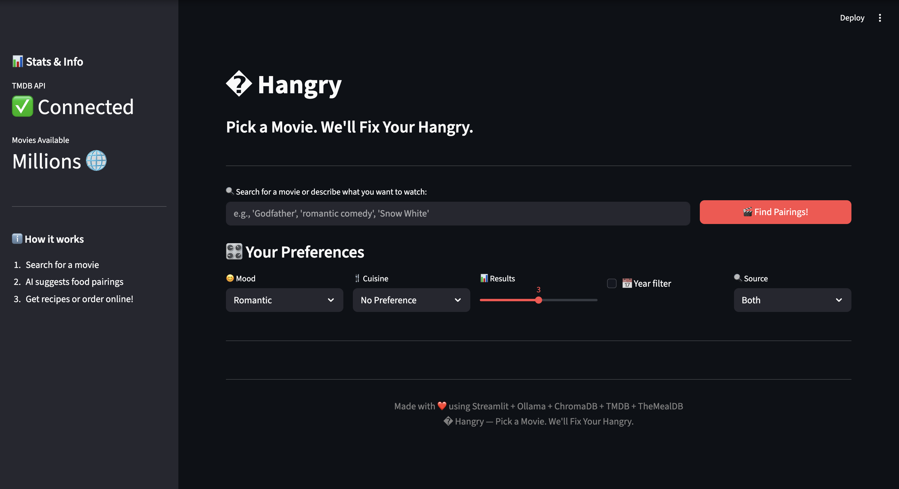
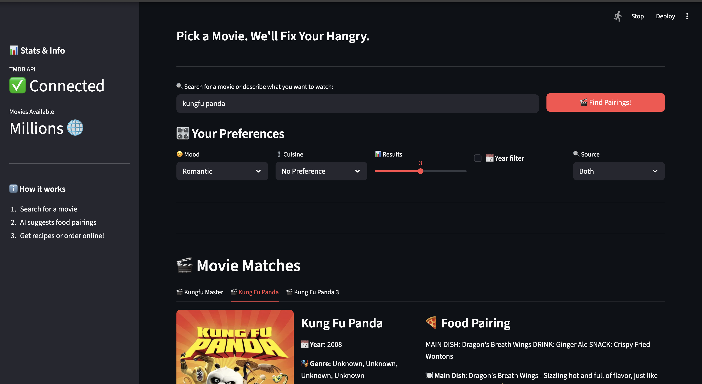
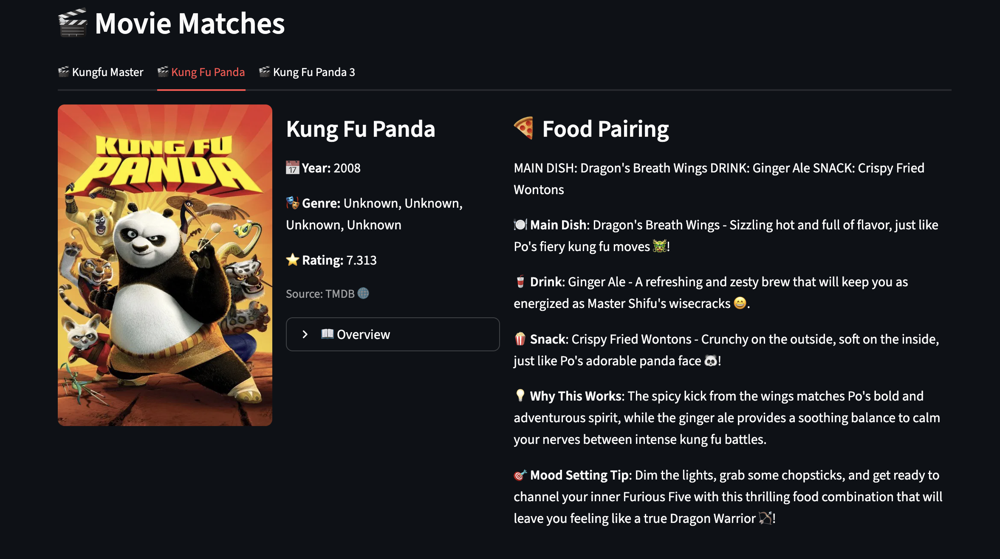
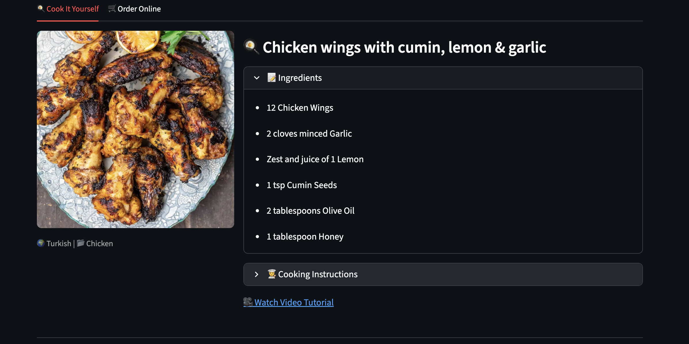
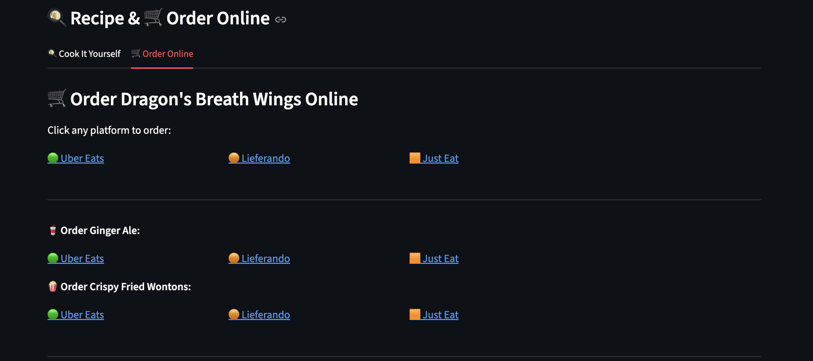

# � Hangry

Pick a Movie. We'll Fix Your Hangry.

An AI-powered app that pairs movies with the perfect food, drinks, recipes, and delivery links.

## Features
- 🔍 **Hybrid Movie Search** — TMDB API (millions of movies) + ChromaDB (10K local IMDB)
- 🤖 **AI Food Pairing** — Llama 3 suggests dishes based on movie themes, mood & cuisine
- 📖 **Recipe Lookup** — TheMealDB integration with smart search
- 🛵 **Order Online** — Deep links to Lieferando, Uber Eats, DoorDash, Grubhub & more
- 🎯 **Filters** — Year range, mood, cuisine preference, search source
- 🔥 **Trending Movies** — Live TMDB trending feed

## Tech Stack
- **UI**: Streamlit
- **LLM**: Ollama (Llama 3) via LangChain
- **Vector DB**: ChromaDB (local semantic search)
- **Movie API**: TMDB (The Movie Database)
- **Recipe API**: TheMealDB
- **Data**: IMDB dataset (via kagglehub)

## Setup

```bash
# Clone & enter
git clone https://github.com/ram07eng/just-hangry.git
cd just-hangry

# Create virtual environment
python -m venv venv
source venv/bin/activate

# Install dependencies
pip install -r requirements.txt

# Start Ollama (separate terminal)
ollama serve
ollama pull llama3

# Run the app
streamlit run app/main.py
```

## Project Structure
```
hangry/
├── app/main.py       # Streamlit app
├── notebooks/        # Jupyter notebooks (data exploration, RAG build)
├── data/imdb/        # IMDB TSV datasets
├── vectorstore/      # ChromaDB persistent storage
├── requirements.txt
└── README.md
```

<details>
<summary><strong>📸 Demo</strong></summary>

### 🔍 Search Movies


### 🎬 Movie Results


### 🤖 AI Food Pairing


### 📖 Recipe Lookup


### 🛵 Order Online


</details>

## Author
Ramanujam Solaimalai 🚀